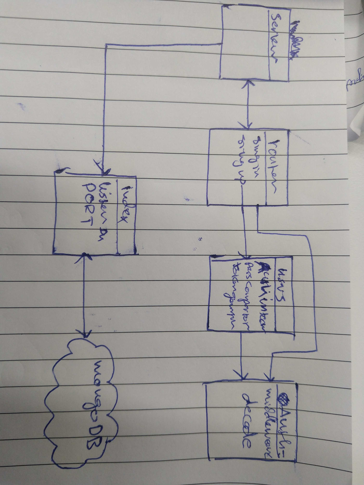

# LAB - Class 12

## Oauth

### Author: Naseem/Ibrahim

### Links and Resources

- [submission PR](https://github.com/401-advanced-javascript-ibrahim/oauth/pull/1)

### Setup

#### `.env` requirements (where applicable)

- `PORT`=3000
- `MONGODB_URI`=mongodb://localhost:27017/lab11
- `SECRET`=hikari
- `CLIENT_ID`=09c3b8300fb51bba9329
- `CLIENT_SECRET`=429547399a7dcf921ea0f366e6d333354ceedf2e
- `API_SERVER`=http://localhost:3000/oauth

#### How to initialize/run your application (where applicable)

- `npm run start`

#### UML

